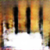
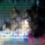
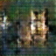
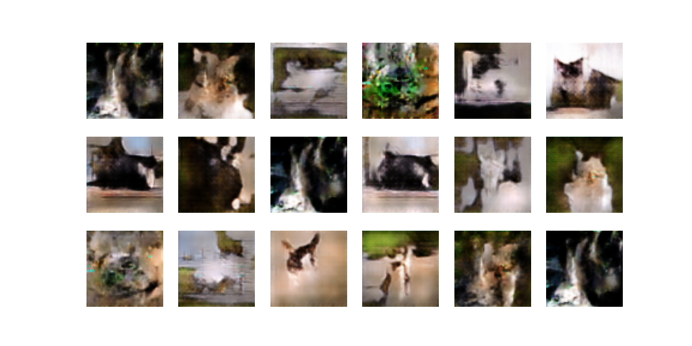
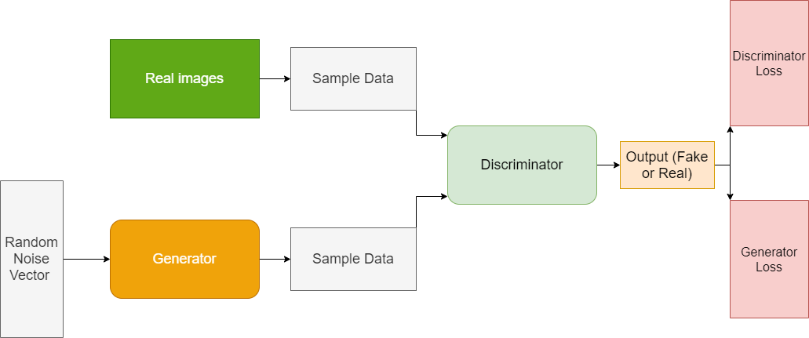

# 🎨 Image generator - GAN


  


## 📝 Project Description  
This repository implements a **Generative Adversarial Network (GAN)** using PyTorch.  
It allows training and using a generator model to produce realistic images of **Cat**🐈 from random noise vectors.  
The project is designed to be modular, so you can **train your own GAN** on a custom dataset or **load pre-trained models** to generate images quickly.

For me, I used a dataset of cat pictures to train it ! 😺

---

## ⚙️ Features
- 🎨 **Train a GAN** on your own dataset of images.
- 💾 **Save and reload** both generator and discriminator models.
- 🎲 **Generate batches of fake images** directly from random noise.
- 📊 **Visualization of generated samples** during training.
 

## 🖼️ **Example of generated output** :  
 
 



**🔍 Preliminary Results:**  
Some generated images show **recognizable cat features** ✅, but results still need improvement.  
*Longer training (~13h GPU 💻🔥) would be required for sharper, more realistic outputs.*

---

## ⚙️ **How It Works**

- **🎨 Generator (GNet)**
   Transforms a **random noise vector** (latent space: 📏 `100`) → **synthetic images** (🖼️ `3x64x64`).

- **🔍 Discriminator (DNet)**
   Receives **real** or **generated images** → outputs a **probability** of being **"real"** (✅ or ❌).

- **🔄 Training Loop**
   - **Discriminator**: Learns to **distinguish** real 📸 vs. fake 🤖 images.
   - **Generator**: Learns to **fool** 🎭 the discriminator.
   - **Optimizer**: **Adam** (📈 `lr=0.0002`).

- **💾 Save & Reuse**
   Models are saved as **`.pth` files** for later **inference** or fine-tuning.

## 🗺️ Schema
Here is the GAN architecture :


---

## 📂 Repository Structure  

```bash
/file  
├── Dataset_image/   
│ ├── image_folder/chats            # Folder containing training images / Here, it's cat 😺 !  
│ ├── model/                        # Saved models (generator & discriminator)  
│ ├── result_image/                 # Generated results  
├── Img/                            # Subfolder with the example image for the README.md  
├── LICENSE  
├── README.md  
├── main.py
```
---
## 💻 Run it on Your PC  
Clone the repository and install dependencies:  
```bash
git clone https://github.com/Thibault-GAREL/Image_generator_GAN.git
cd Image_generator_GAN
pip install numpy torch torchvision matplotlib
# install with Cuda:
# pip install torch torchvision torchaudio --index-url https://download.pytorch.org/whl/cu118
```

Train the GAN (adjust number of epochs 🔁 in the script):  
```bash
python main.py
```
To **generate** and **display images** using the last models:
```bash
python main.py  #Put num_epochs = 0 l.40
```
---
## 📖 Inspiration / Sources  
- 🎥 I follow the learning video : [GAN from NeoCode](https://youtu.be/FWf7NXLjx9c?si=aDglR2UlTNXCPg4-)